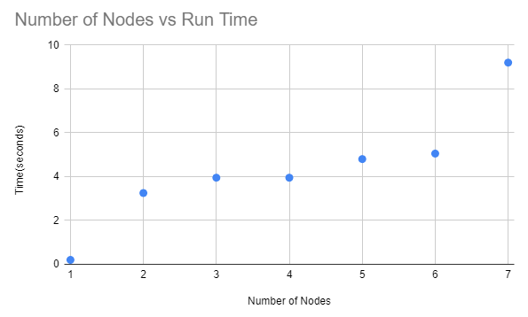

# MP3

to run this file within the directory type\
`go build MP3`

The config file has 3 important parameters:
* The top line should contain the min and max delay in milliseconds

* The next line should contain the ip and port of the master server which will listen to and output all the sorting values

* All lines below that begin with the node ID followed by the value, ip address, and port

This program uses the master server like Darius had suggested as it controls the server information presented by the nodes.

I have commented in the `nodes/node.go` that there is a line that can manipulate the chances of a node being faulty. This can be changed but my program has an issue where if multiple nodes crash the run time dramatically increases.

It also appears that the nodes that are tampered with beforehand to be closer in value are more likely to show a faster run time upon testing. Setting all nodes to the same value causes some strange print statements but will end the program in less than a second.

The graph below shows the correlation between the number of nodes and the run time:

It seems as though there is a slight direct correlation between run time and delays, but I also increased the range of inputs so I believe that that is the factor causing the problems.

The most obvious factor that hindered performance was changing the delay values themselves which I experimented with as well.

The maximum number of rounds I reached was 7 with 7 nodes, but it seemed to be an outlier.